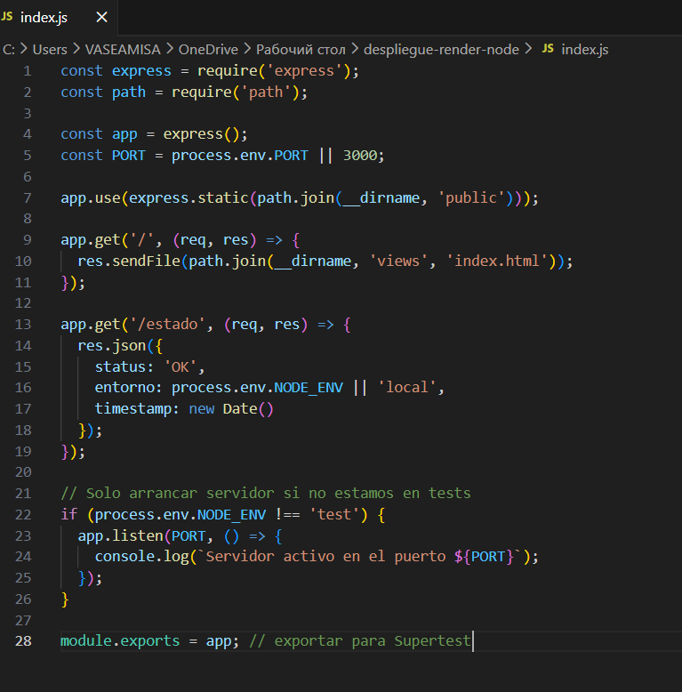
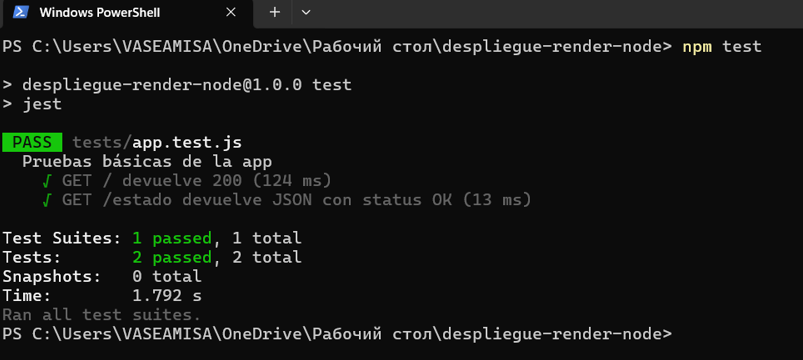
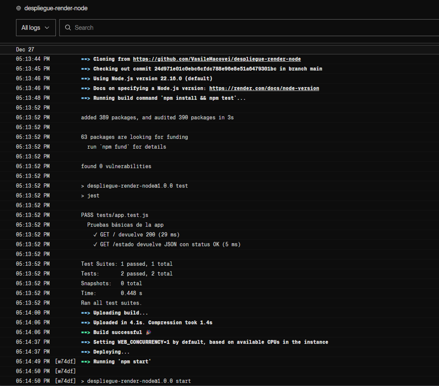

# HITO 4 - Pipeline Completo con Despliegue, Tests y Rollback

## Introducción

En este hito se ha construido un pipeline CI/CD completo utilizando GitHub y Render, integrando pruebas automáticas, despliegue continuo, rollback y documentación del proceso.
Se parte del proyecto desarrollado en el Hito 3, al que se le añaden tests y automatización del despliegue.

El flujo seguido es el siguiente:

**Desarrollo local → Tests → GitHub → Build → Deploy → Rollback → Verificación**

---

## Tecnologías Utilizadas

- Node.js
- Express
- Jest
- Supertest
- Git y GitHub
- Render

---

## 1\. Preparación del Proyecto en Local

En primer lugar, se añadieron las herramientas necesarias para la ejecución de tests automáticos. Estas dependencias se instalaron como dependencias de desarrollo, ya que solo son necesarias en entornos de desarrollo y durante la fase de build:

```bash
npm install --save-dev jest supertest
```

Posteriormente se modificó el archivo `package.json` para incluir el script de test:

```json
"scripts": {
  "test": "jest"
}
```

Gracias a esto, todos los tests pueden ejecutarse mediante el comando:

```bash
npm test
```

## 2\. Modificación del Servidor para Testing

Se modificó el archivo `index.js` para permitir el uso de Supertest sin necesidad de levantar el servidor real durante la ejecución de los tests.

De este modo, el servidor solo se inicia en entorno de producción, garantizando una correcta separación entre:

- Entorno de testing
- Entorno de ejecución (runtime)



## 3. Definición y Ejecución de los Tests

Se creó una carpeta `tests/` que contiene el archivo `app.test.js`.

Los tests definidos son:

- **GET /**

  - Código de estado esperado: `200`

- **GET /estado**
  - Código de estado esperado: `200`
  - Respuesta JSON esperada:
    ```json
    { "status": "OK" }
    ```

Antes de subir los cambios al repositorio remoto, los tests se ejecutaron correctamente en local utilizando:

```bash
npm test
```



## 4. Commit Inicial del Hito 4 (base para Rollback)

Se realizó un cambio identificable en `index.html` para marcar el commit inicial:

```html
<h3>Este es el commit al que realizaremos en el futuro un rollback</h3>
```

Commit realizado:

```
Hito 4: Añadidos tests y preparación del pipeline
```

## 5. Subida de Cambios a GitHub

Los cambios se subieron a la rama `main`, que es la rama monitorizada por Render.
Cada nuevo commit en esta rama actúa como disparador del pipeline de despliegue.

## 6. Despliegue Continuo en Render

Se creó un Web Service vinculado al repositorio de GitHub.

Configuración del servicio:

- **Rama:** main

- **Build Command:** npm install && npm test

- **Start Command:** npm start

- **Auto-Deploy:** On Commit

- **Tipo de instancia:** Free

Cada nuevo commit en la rama main provoca automáticamente un nuevo despliegue.

## 7. Pasos Ejecutados por Render durante el Despliegue

Durante el despliegue, Render ejecuta automáticamente los siguientes pasos:

1. Clonación del repositorio

2. Verificación del commit

3. Instalación de dependencias

4. Ejecución de los tests

5. Arranque de la aplicación

Los logs de Render confirman que los tests se ejecutan correctamente antes de permitir el despliegue.



## 8. Verficación del Primer Despliegue

Tras el despliegue, la aplicación quedó accesible mediante la URL proporcionada por Render.

- El texto del commit inicial aparece correctamente en la web.

- El endpoint `/estado` devuelve:

```json
{ "status": "OK" }
```

## 9. Commit Final del Hito 4

Se modificó `index.html` con el siguiente texto:

```html
<h3>Este es el commit final para el hito 4</h3>
```

Commit realizado:

```
Commit final - Hito 4
```

Render detectó automáticamente el commit y desplegó la aplicación con éxito.

## 10. Verificación del Despliegue Final

- El texto actualizado aparece correctamente en la web.

- El endpoint `/estado` sigue funcionando correctamente.

## 11. Rollback

Se realizó un rollback desde Render al commit inicial del Hito 4.

Durante el rollback, **Render reutiliza el artefacto**, por lo que no se ejecuta el build de nuevo, haciendo el proceso más rápido.

## 12. Verificación tras el Rollback

La web vuelve a mostrar:

```html
<h3>Este es el commit al que realizaremos en el futuro un rollback</h3>
```

Además el endpoint `/estado` sigue funcionando correctamente.

Esto confirma que el rollback se realizó correctamente y que la versión desplegada corresponde al commit esperado.

## 13. Conclusión

Se ha implementado con éxito un pipeline CI/CD completo que integra:

- Tests automáticos

- Despliegue continuo

- Control de versiones

- Rollback funcional


